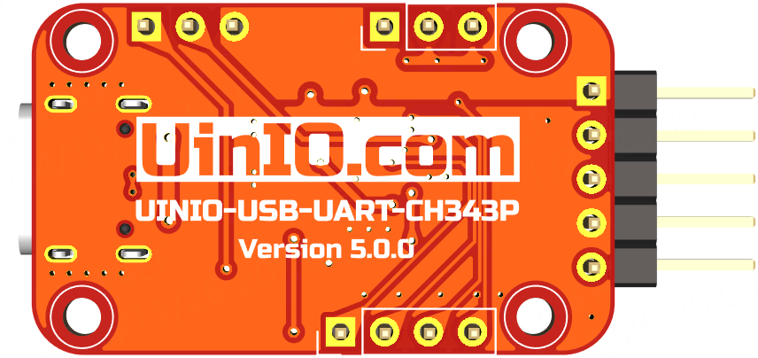

# UINIO-USB-UART

基于[**苏州沁恒 CH343**]() 以及[**美国芯科 CP2102**](https://www.silabs.com/interface/usb-bridges/classic/device.cp2102) 两款 USB 转 UART 芯片的开源串口调试工具。

- 采用拼板方案设计，两款芯片均支持 `961200` 及以上波特率；
- 加入自恢复保险丝，为后级电路提供短接保护；
- 提供 `RXD` 以及 `TXD` 的信号读写指示灯；
- 采用 **16 Pin** 的 **USB Type-C** 接口；
- 引出了包括**串口硬件流控信号线**在内的全部片上资源；
